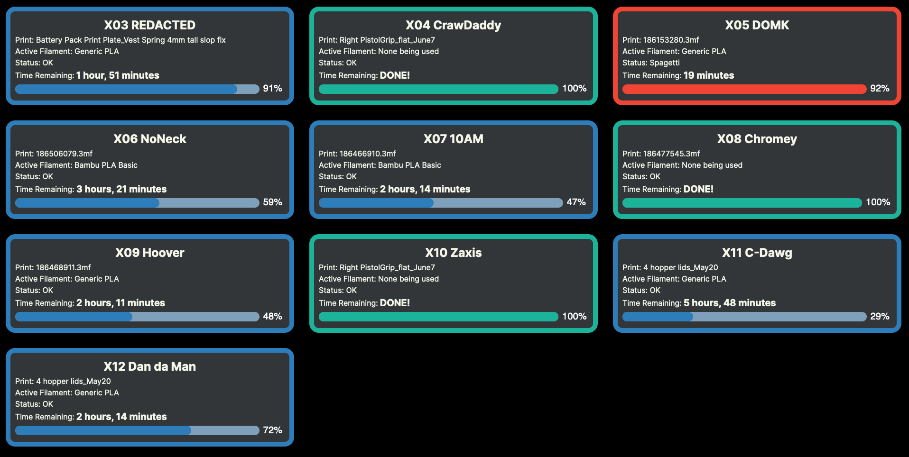

### Bambu Plant

## Display info

This is an example screen for 10 bambu X1C printers running:


Outline:

- Blue - Printer is currently running
- Green - The printer is done printing
- Red - Error
- Yellow - idle rarely actually displays for some reason the printer is always done or running

Information:

- Print: displays the current or last print job
- Active filament: This displays the filament currently being used by the printer. These printers have four options and only can use one at a time (duh) this displays which of the four the printer is using
- Status: Displays OK or Displays ERROR: [error code]. For some error codes they have been hardcoded for their acutal meaning
- Time remaining: Displays the time estimate remaining on the printer.

## Setup

There are a few things that need to be done/gathered with the printers:

- Enable "LAN Mode Liveview" (Not LAN Only)
  - From the Bambu icon on the printer, tap "General"
  - Enable the box next to "LAN Mode Liveview"
  - Write down the number next to "Device Info" (This is the device serial number)
- Grab the Access Code and IP Address
  - From the Bambu icon on the printer, tap "Network"
  - Write down the "Access Code"
  - Write down the "IP"

Now, create a `config.json` file in the ./server directory that looks like this:

```json
{
  "machines": [
    {
      "id": "<Device Serial Number>",
      "name": "<Display Name of the printer>",
      "token": "<Access Code>",
      "ip": "<IP Address>"
    },
    {
      "id": "<Device Serial Number>",
      "name": "<Display Name of the printer>",
      "token": "<Access Code>",
      "ip": "<IP Address>"
    }
  ]
}
```

Create an entry for each printer you want to display.

## Launching

In one ternimal run `node ./server/index.js` to launch the mqtt subscribers, and in another ternimal run `cd app`, `yarn`, and then `yarn dev` to launch the app
